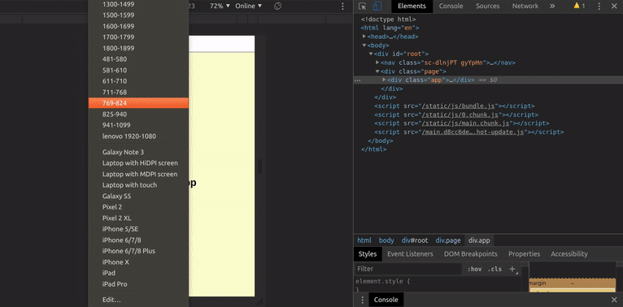

## RESPONSIVE NAVBAR

#### Continuing my research for the Simple navbar

<p>I am not too convinced of this kind of navbar because i love gsap animated ones, but 
i think it s good to discover as many possibilities as possible.</p>

<br>
<br>

[](https://nadiamariduena.github.io/animated-portfolio-with-intersection-observer/)

<br>
<br>

### PREVIEW

<p> You will need to set up a useState to animate the lines </p>

```javascript
import React, { useState } from "react";
```

<br>
<br>

```javascript
const Burger = () => {
  const [open, setOpen] = useState(false);

  //  if open is true , transform it to false:  onClick={() => setOpen(!open)}>

  return (
    <React.Fragment>
      <StyledBurger open={open} onClick={() => setOpen(!open)}>
        {/* the divs below represent the lines of the hamburger */}
        <div />
        <div />
        <div />
      </StyledBurger>
      <RightNav open={open} />
    </React.Fragment>
  );
};
```

<br>
<br>

```javascript
    //
    &:nth-child(1) {
      transform: ${({ open }) => (open ? "rotate(45deg)" : "rotate(0)")};
    }

    &:nth-child(2) {
      transform: ${({ open }) => (open ? "translateX(100%)" : "translateX(0)")};
      //   default is 0 and when opened is 1
      opacity: ${({ open }) => (open ? 0 : 1)};
    }
    &:nth-child(3) {
      // will rotate on the sense contraire to the (1) one
      transform: ${({ open }) => (open ? "rotate(-45deg)" : "rotate(0)")};
    }
```

<br>
<br>
<br>
<br>

## ANIMATION STEPS (you hve to follow the steps inside the NavbarRight.js)

```javascript

                                            // ---------
                                            // ANIMATION
                                            // ---------

                        // correspond to the animation steps ONLY

        //      1) REPLACE THE :

            import React from "react";

       //   for:

        import React, { useState } from "react";


       /*

       Using the  { useState } will allow us to create
        the animation by setting up the state and the setState
        , the state is the default state of the element we want to
        handle in this case the burger lines, and the setState is the
        changed state of this element "changed when clicked" as it will
        change the default initial state.

        */


      //  2_) declare it, here you chose how it will be called,
       //     since we have to open it to see the content i will call it "open":


              const [open, setOpen] = useState(false);
  /*
        - If you notice the initial/default is : open
        - and the change state of the default will be: setOpen
        - useState is the hook state(which is : FALSE)
*/


     //   3)_ Add the hook "usestate" to the element you want to change
     //   "the lines parent box" :


    <StyledBurger open={open} onClick={() => setOpen(!open)}>


      <div />
      <div />
      <div />


    </StyledBurger>

/*
 <StyledBurger open={open} onClick={() => setOpen(!open)}>

     what this does: get the false or default value of the open
        and transform it to  TRUE, and if open is true or opened
        transform it to FALSE/close

   4_ ) ONCE THIS IS DONE, add the {open} to the 3 lines :
*/


    //this is related to the origin of rotation of the lines
    //
    //
    &:nth-child(1) {
      transform: ${({ open }) => (open ? "rotate(45deg)" : "rotate(0)")};
    }
    &:nth-child(2) {
      transform: ${({ open }) => (open ? "translateX(100%)" : "translateX(0)")};
      //   default is 0 and when opened is 1
      opacity: ${({ open }) => (open ? 0 : 1)};
    }
    &:nth-child(3) {
      // will rotate on the sense contraire to the (1) one
      transform: ${({ open }) => (open ? "rotate(-45deg)" : "rotate(0)")};
    }
  }


      - this line is going to be send away in an x axe when clicked for then
      the line 1 and the line 3 will form the x shape.

       &:nth-child(2) {
      transform: ${({ open }) => (open ? "translateX(100%)" : "translateX(0)")};
      //   default is 0 and when opened is 1
      opacity: ${({ open }) => (open ? 0 : 1)};
    }


    // --------------------------------------------------------
  //  ITS NOT GOING TO WORK YET as you have to add the following:


        // this is just the lines changing color when clicked
    background-color: ${({ open }) => (open ? "#ccc" : "#222")};


    // ---------
    transform-origin: 1px;  //this will make the X shape crossing possible

    // ------------
    //
    // without the linear transition, the line in the middle will not move
    transition: all 0.3s linear;
```

<br>
<br>
<br>
<br>

<hr>

## Dependencies

```javascript

npm i react

npm i react-dom

npm i react-scripts

npm i node-sass --save

npm i autoprefixer@9.8.0

npm i gh-pages --save-dev

npm i styled-components

npm i react-router-dom
```

<br>
<br>
